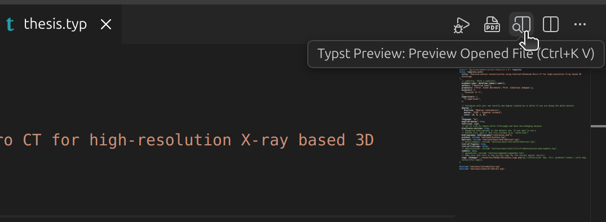

# Reuse and modification of [this template](https://github.com/benjamineeckh/kul-typst-template) for 2025-2026 MSc thesis, Sean Nachtrab

The rendered thesis is under template > thesis.pdf [here](https://github.com/Nachtraven/ucl-2026-based-on-kul-typst-template/tree/main/template)

Alternatively: Open the repository in VSCode with the typst extension, and open the preview



Generic SOTA -> keep it specific to what you’re doing
~ 5-10-10-10-5
Intro 5 pp
SOTA 10pp
Technologie/technique 10pp
Methodologie 10pp
Resultats 10pp
Conclusion 3-5 pages (discussion et repossitionner le travail)


# Thesis Goals (instructions) - From "Scientific writing/Master thesis: tips and tricks"

Master thesis objectives
The master thesis is
• the opportunity to acquire transversal competencies
• a project aiming at solving a complex engineering problem
An EPL master thesis may have
• a major “research” component                  -- Both dimensions are possible
• a major “technological development” component --^
These objectives are translated into learning outcomes (LO's) derived from the EPL competency framework.

Learning outcomes
1. ... to demonstrate he-she masters a body of knowledge and basic skills in science and/or engineering sciences, bound about his/her thesis.
2. ... to lead to completion a major, in amplitude and spent time, engineering approach applied to the development of a product, service
or facility referred to the thesis.
3. ... to lead to completion a major, in amplitude and spent time, research work aiming at the understanding and the contribution to the resolution of an original scientific question of theoretical or physical type.
4. ... to organise and plan the master thesis work on the basis of allocated resources and time constraints, of security (if applicable) and of available competencies.
5. ... to efficiently communicate both orally and in writing to realise the master thesis.
6. ... to take into account the societal impact of his/her master thesis (possible economical recovery and/or ethical impact and/or environmental and/or social impact).

A dissertation realized by one student should be approximately 40 pages in length, and not exceed 60 pages (excluding annexes).

## Instructions:

Problem statement, aim and objectives:
✓ Formulate again relevant, simple, measurable, and feasible research questions that are still remaining (should be clear after reading the SOTA)
✓ State the research aim or hypothesis of the project, and formulate concrete objectives

## Words to use

Illustration: as shown by, e.g., especially, for example, for instance, in particular, namely, particularly, specifically, such as, that is, to illustrate.
Addition: again, and, also, besides, equally important, first (second, etc.), further, furthermore, in addition, in the first place, moreover, next.
Comparison: also, in the same manner, likewise, similarly.
Contrast: although, and yet, at the same time, but, despite, even though, except, however, in contrast, in spite of, nevertheless, on the contrary, on the other hand, regardless, still, though, unlike, whereas, yet.
Logical relation: accordingly, as a result, because, consequently, for this reason, hence, if, otherwise, since, so, then, therefore, thus.
Temporal relation: after, afterward, as, as long as, as soon as, at last, before, during, earlier, finally, formerly, immediately, later, meanwhile, next, since, shortly, subsequently, then, thereafter, until, when, while.
Spatial relation: adjacent to, above, below, beyond, close, elsewhere, here, nearby, opposite, to the right, left, north, east, south, west, etc.
To summarize or conclude: in conclusion, in summary, on the whole, that is, therefore, to conclude, to sum up.
-> To increase the attractiveness of your text, vary the order of clauses in consecutive sentences
-> Use formal wording: much, many, perform, carry out, conduct, large, such as, consider, discuss, examine, obtain, retain, preserve, ascend
-> Quantify: "the thickness difference is of xxx millimeters"
-> Avoid specialist terms the readers will not understand
-> Results must be discussed: explain what is learned and why, not just numbers
-> Provide a caption to your table or figure. This caption should be sufficiently informative to understand the table or figure without reading the main text

## References

✓ In-text citations include the surname of the author and date, either both inside parentheses or with the author names in running text and the date in parentheses. For example:
“Recently, Johnson et al. (2014) have shown that” or “This has recently been shown by Johnson et al. (2014)”
✓ You can also use the reference numbers. For example: “Recently, Johnson et al. [1] have shown that” or “This has recently been shown by Johnson et al. [1]”


--

--

--

--


# Bellow is the original README:

# The `modern-se-kul-thesis` Package
<div align="center">Version 0.1.0</div>

This is an unofficial typst template for doing a thesis at the engineering science faculty at KU Leuven.
This was made by trying to as closely follow the Latex template [here](https://eng.kuleuven.be/docs/kulemt).
## Usage

You can use this template in the web editor by going to "start from template" and searching for "modern-se-kul-thesis".
Alternatively, you can use this template locally by running:
```typ
typst init @preview/modern-se-kul-thesis
```
This will then create a basic folder structure with some fields pre-filled.

## Configuration
- `title`: The title of the thesis.
- `subtitle`: An optional subtitle.
- `academic-year`: Can be a starting year (e.g. 2025) or a tuple of start and end year (e.g. 2025,2027)
- `authors`: An array of all the authors.
- `promotors`: An array of all the promotors.
- `assessors`: An array of all the assessors.
- `supervisors`: An array of all the supervisors.
- `degree: An array containing`: the name of your master, elective and the specified color in hsv (default is for computer science).
- `language`: "en" or "nl".
- `electronic-version`: A boolean toggle to set the thesis as electronic.
- `english-master`: A boolean toggle to use the template for the English master.
- `list-of-figures`: Toggle to add a list of figures.
- `list-of-listings`: Toggle to add a list of listings (code blocks).
- `font-size`: Font size toggle.
- `preface`: The preface of your thesis goes here.
- `abstract`: The abstract of your thesis goes here.
- `dutch-summary`: The dutch summary of your thesis goes here.
- `abbreviations`: The abbreviations used in your thesis go here.
- `symbols`: The symbols used in your thesis go here.
- `bibliography`: The bibliography of your thesis goes here.
- `appendices`: The appendices of your thesis goes here.
- `logo`: The logo of the university for the front page, the logo should be copied from the kulemt latex template
```typ
#import "@preview/modern-se-kul-thesis:0.1.0": template
#show: template.with(
title: [The main title],
subtitle: [The subtitle],
academic-year: 2025,
authors: ("an Author",),
promotors: ("a promotor",),
assessors: ("an assessor",),
supervisors: ("a supervisor",),
degree: (
    elective: "Software engineering",
    master: "Computer Science",
    color: (0, 0, 1, 0),
),
language: "en",
electronic-version: false,
english-master: false,
list-of-figures: true,
list-of-listings: false,
font-size: 11pt,
preface: [#lorem(100)],
abstract: [#lorem(100)],
dutch-summary: [#lorem(100)],
abbreviations: [WIP: Work in progress],
symbols: [$Omega$:Ohm],
bibliography: include bibliography.bib,
appendices: [#lorem(100)],
logo: [Temp]
)
// Put your thesis content here
```
